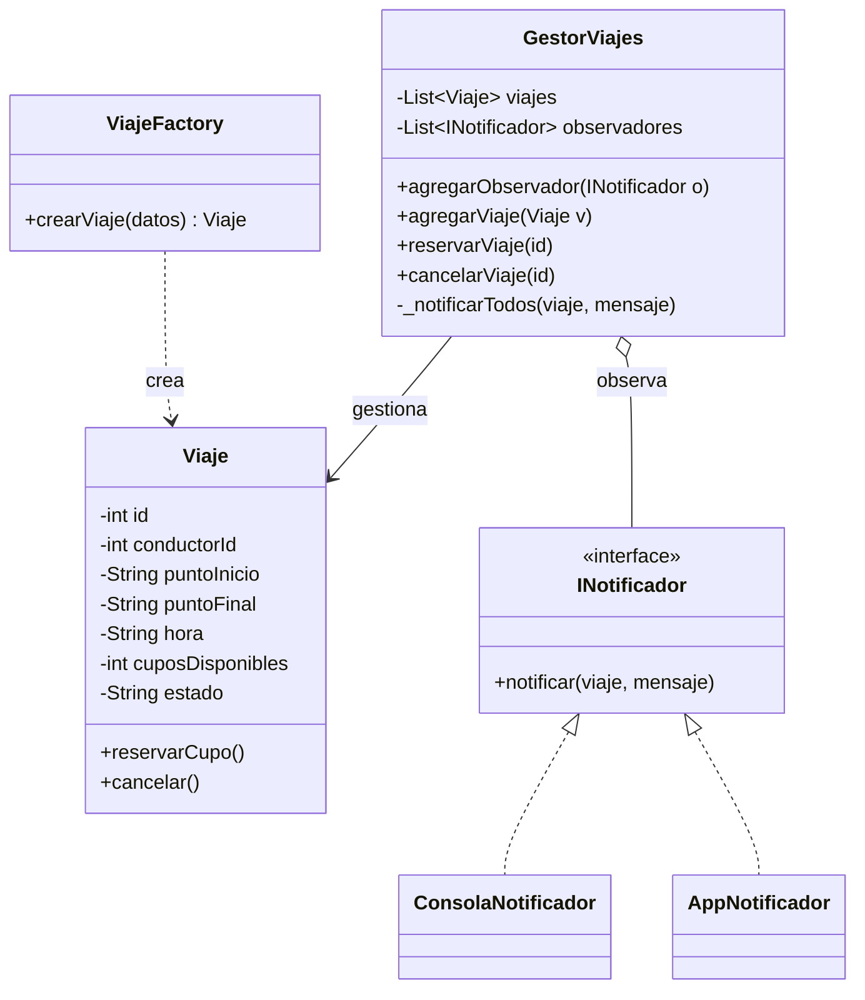

# Proyecto de Diseño de Software – Corte Uno
## WHEELS – Transporte Universitario

## 1. Presentación del Problema

Muchos estudiantes universitarios que no tienen carro propio dependen de
compañeros que sí lo tienen para movilizarse hacia y desde el campus. Sin
embargo, la oferta de estos servicios está **dispersa y desorganizada**:
se coordina por grupos de WhatsApp, carteleras físicas o de boca en boca,
sin un lugar centralizado donde ver qué viajes hay disponibles, a qué
hora, con cuántos cupos y hacia dónde. Esto genera incertidumbre, viajes
perdidos y falta de confianza entre conductores y pasajeros.

**WHEELS** centraliza esta información: los conductores publican sus
viajes (ruta, hora, cupos disponibles) y los pasajeros pueden verlos y
reservar un cupo, sin depender de mensajes sueltos y desorganizados.

Resolverlo con software permite **automatizar** lo que hoy se hace
manualmente: publicar un viaje, ver cupos en tiempo real, evitar que
alguien reserve un cupo que ya no existe, y notificar automáticamente a
conductor y pasajero cuando algo cambia — algo que un chat de WhatsApp no
puede garantizar.

**Alcance de este módulo (Corte 1):** el sistema gestiona la creación,
listado, reserva y cancelación de viajes universitarios, con notificación
automática a los involucrados. Queda **fuera de alcance** en este corte:
autenticación real de usuarios, persistencia en base de datos (se usa
almacenamiento en memoria), pagos, geolocalización en tiempo real y
calificación de usuarios.

## 2. Creatividad en la Presentación

🔗 **Video del proyecto:**  
[Ver recurso visual en YouTube](https://youtu.be/U8I9j75vfkc)

## 3. Fundamentos de Ingeniería de Software

| Atributo de calidad | ¿Cómo se sostiene? | ¿Qué se sacrificó a cambio? |
|---|---|---|
| Mantenibilidad | `INotificador` aísla a `GestorViajes` del mecanismo de notificación (email, push). Agregar un canal nuevo (ej. SMS) no requiere tocar `GestorViajes`, solo crear una clase que implemente `INotificador` | Una capa extra de indirección: para entender qué notificación llega realmente hay que seguir la cadena `GestorViajes → INotificador → implementación concreta` |
| Extensibilidad | Nuevos tipos de viaje o reglas de negocio se pueden agregar en `ViajeFactory` sin modificar el código que ya crea viajes, siempre que se mantenga el mismo contrato | La validación de datos vive centralizada en la fábrica; si en el futuro cada tipo de viaje necesita validaciones distintas, la fábrica tendría que crecer con condicionales o dividirse en varias fábricas |


## 4. Diseño de Software

### 4.1 Principios SOLID aplicados

**SRP (Single Responsibility Principle) — con evidencia antes/después:**

```javascript
// ❌ ANTES: GestorViajes mezclaría la gestión de viajes CON el envío de notificaciones
class GestorViajes {
    reservarViaje(id) {
        const viaje = this.viajes.find(v => v.id === id);
        viaje.reservarCupo();
        // lógica de envío de email/push mezclada aquí mismo
        console.log(`Enviando email a ${viaje.conductorId}...`);
    }
}
// Problema: cambiar de "console.log" a un proveedor real de correo (o agregar
// push) obligaría a modificar GestorViajes, aunque su responsabilidad es
// gestionar viajes, no enviar notificaciones.

// ✅ DESPUÉS (código real del proyecto): responsabilidades separadas
class GestorViajes {
    reservarViaje(id) {
        const viaje = this.viajes.find(v => v.id === id);
        viaje.reservarCupo();
        this._notificarTodos(viaje, `Se reservó un cupo. Cupos restantes: ${viaje.cuposDisponibles}`);
        return viaje;
    }
    _notificarTodos(viaje, mensaje) {
        this.observadores.forEach(obs => obs.notificar(viaje, mensaje));
    }
}
// GestorViajes ya no conoce el mecanismo de notificación. Cambiar de
// consola a un servicio real de email no toca esta clase.
```

**OCP (Open/Closed Principle):** agregar un canal de notificación nuevo (SMS, WhatsApp) se hace creando una clase que implemente `INotificador`, sin modificar `GestorViajes` — ver `ConsolaNotificador.js` y `AppNotificador.js`, ambas implementaciones intercambiables.

**DIP (Dependency Inversion Principle):** `GestorViajes` depende de la abstracción `INotificador`, no de una implementación concreta. Las instancias concretas (`ConsolaNotificador`, `AppNotificador`) se inyectan desde `server.js` con `gestor.agregarObservador(...)`, no se crean dentro de `GestorViajes`.

### 4.2 Patrones de diseño utilizados

| Patrón | Categoría | Problema que resuelve aquí | Alternativa descartada y por qué |
|---|---|---|---|
| **Factory Method** (`ViajeFactory`) | Creacional | Centraliza la creación de `Viaje`: genera el ID y valida los datos obligatorios, sin que las rutas de `server.js` conozcan esos detalles | Se descartó Builder: `Viaje` no se construye por pasos opcionales, solo necesita validar y ensamblar datos que ya llegan completos |
| **Observer** (`GestorViajes` como *Subject*, `INotificador` como *Observer*) | Comportamiento | `GestorViajes` mantiene una lista de `INotificador` y les avisa cuando un viaje cambia de estado (reserva, cupo lleno, cancelación), sin conocer sus tipos concretos | Se descartó un Event Bus con colas (pub/sub asíncrono): el volumen de eventos es bajo para un solo servidor local, no justifica esa complejidad |

### 4.3 Modelado UML



**Tabla de trazabilidad:**

| Clase en el diagrama | Archivo | Coincide |
|---|---|---|
| `Viaje` | `/backend/src/modelo/Viaje.js` | Sí |
| `ViajeFactory` | `/backend/src/factoria/ViajeFactory.js` | Sí |
| `GestorViajes` | `/backend/src/modelo/GestorViajes.js` | Sí |
| `INotificador` | `/backend/src/notificaciones/INotificador.js` | Sí |
| `ConsolaNotificador` | `/backend/src/notificaciones/ConsolaNotificador.js` | Sí |
| `AppNotificador` | `/backend/src/notificaciones/AppNotificador.js` | Sí |

## 5. Implementación

- `/backend/src/modelo`: `Viaje` (entidad), `GestorViajes` (lógica de negocio y Subject del Observer).
- `/backend/src/notificaciones`: `INotificador` (interfaz), `ConsolaNotificador`, `AppNotificador` (implementaciones concretas).
- `/backend/src/factoria`: `ViajeFactory` (Factory Method).
- `/backend/src/server.js`: arma las dependencias (inyección de `INotificador` en `GestorViajes`) y expone la API REST.
- `/mobile`: app en Expo/React Native (interfaz para conductores y pasajeros).

**Instrucciones de ejecución (backend):**
```bash
cd backend
npm install
npm start
```
Servidor disponible en `http://localhost:3000`. Endpoints: `POST /viajes`, `GET /viajes`, `POST /viajes/:id/reservar`, `POST /viajes/:id/cancelar`.

**Instrucciones de ejecución (app móvil):**
```bash
cd mobile
npm install
npx expo start
```
Escanea el QR con la app Expo Go.

## 6. Análisis Técnico

- **Alta cohesión:** `GestorViajes` solo gestiona el ciclo de vida de los viajes (crear, reservar, cancelar); no contiene lógica de envío de notificaciones ni de validación de datos de entrada (eso vive en `ViajeFactory`).
- **Bajo acoplamiento:** comprobado en que `GestorViajes` puede probarse con un `INotificador` de prueba (mock) sin necesidad de un servicio real de correo o push — se verificó en las pruebas manuales con `ConsolaNotificador` y `AppNotificador` corriendo en paralelo sin conflicto.
- **Límite honesto del diseño:** el sistema actual no persiste datos (se pierden al reiniciar el servidor) ni valida duplicados de reserva por el mismo usuario; agregar eso requeriría un patrón Repository y un modelo de usuario, fuera del alcance de este corte.

## 7. Corte 2 – Avance

> En este corte evolucionamos el sistema para responder a tres retos: **autenticación con QR**, **contacto de emergencia** y **planeación de viajes**. Este avance cubre el análisis de los retos y la selección del estilo arquitectónico. La implementación y las pruebas vienen en la entrega final.

**Estilo elegido:** arquitectura **hexagonal (puertos y adaptadores)**, comparada contra arquitectura en capas y microservicios.

**Documentación:**
- [Documento de arquitectura](docs/arquitectura.md): retos, comparación de estilos y diagramas.
- [ADR-001: arquitectura hexagonal](docs/adr/ADR-001-arquitectura-hexagonal.md)
- [Diagramas](docs/diagramas/): contexto, contenedores y componentes (C4) y arquitectura inicial del Corte 1.

### Tabla de trazabilidad (borrador)

Los tres retos exigen **funcionalidad nueva**, lo cual el enunciado permite cuando el reto lo pide. Las columnas *Dónde está*, *Prueba* y *Resultado* son la meta planeada; se confirman cuando el código esté implementado.

| Reto | Atributo de calidad | Decisión arquitectónica | Dónde está (planeado) | Prueba que lo evidencia (planeada) | Resultado |
|---|---|---|---|---|---|
| **Autenticación QR:** solo quien reservó puede abordar; el código no se falsifica ni se reutiliza | Seguridad / mantenibilidad | Puerto IGeneradorCodigo con un adaptador GeneradorQR; la regla de validación vive en el caso de uso ServicioReservas | `backend/src/puertos/IGeneradorCodigo.js`, `backend/src/adaptadores/salida/qr/`, `backend/src/aplicacion/ServicioReservas.js` | Unitarias: código válido, vencido, alterado y ya usado. Integración: reservar y validar el QR por HTTP | Pendiente |
| **Contacto de emergencia:** la alerta llega al contacto aunque falle un canal | Disponibilidad / extensibilidad | Nuevo adaptador EmergenciaNotificador sobre el puerto INotificador (Observer del Corte 1); si un canal falla se intenta el siguiente | `backend/src/puertos/INotificador.js`, `backend/src/adaptadores/salida/notificaciones/`, `backend/src/aplicacion/ServicioEmergencia.js` | Unitaria con un notificador de prueba que falla. Carga: muchas alertas al mismo tiempo | Pendiente |
| **Planeación de viajes:** programar viajes a futuro, que no se pierdan y buscarlos rápido | Rendimiento / mantenibilidad | Puerto IRepositorioViajes con adaptadores RepositorioSQLite y RepositorioMemoria; búsqueda por fecha, origen y destino | `backend/src/puertos/IRepositorioViajes.js`, `backend/src/adaptadores/salida/persistencia/` | Integración con SQLite en memoria. Carga con k6 sobre la búsqueda (SLO por definir antes de ejecutar) | Pendiente |

## 8. Créditos y Roles

| Integrante | Rol / contribución |
|---|---|
| Gabriel Armando González Sosa | Diseño UML (diagrama de clases) y desarrollo de la app móvil (Expo/React Native)s |
| Daniel Felipe Forero Sánchez | Implementación del backend (Express), aplicación de patrones de diseño (Factory Method, Observer) y principios SOLID |
| Laura Sofía Rodriguez Gonzalez| Documentación del Wiki |

---


