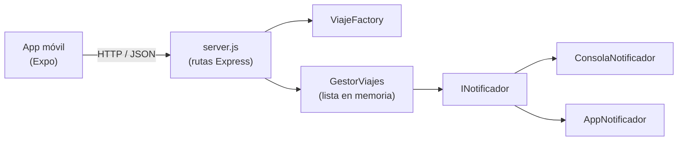
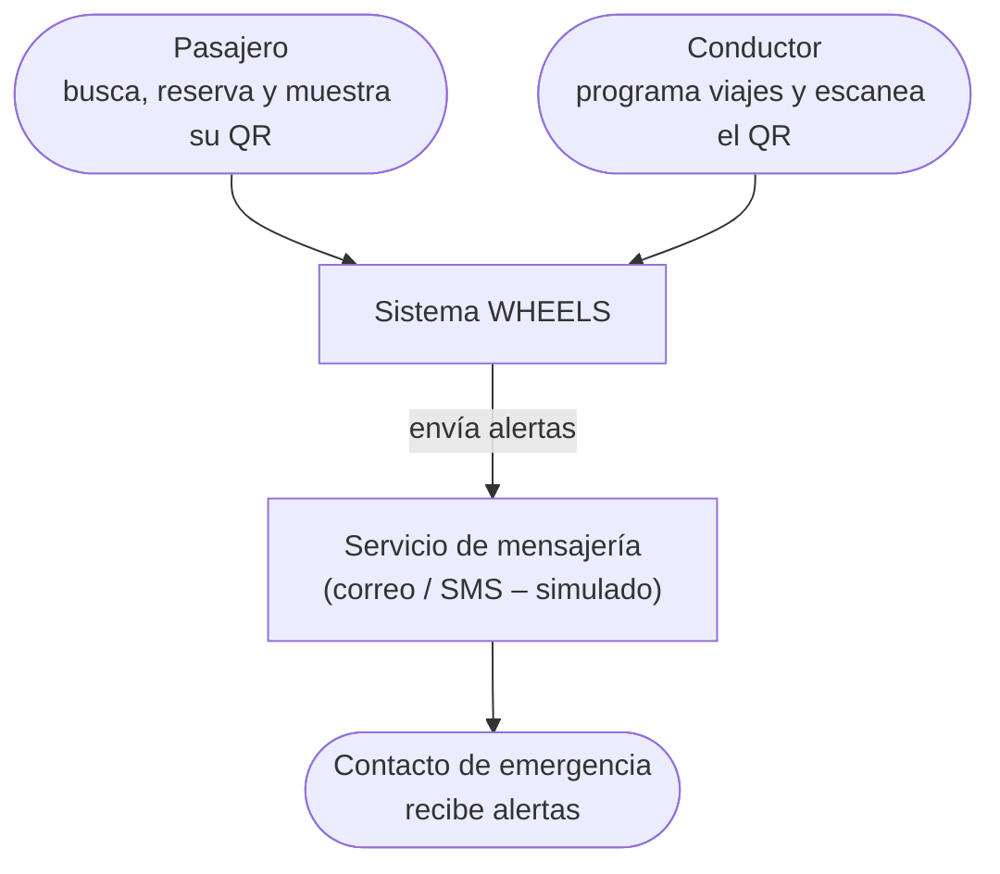
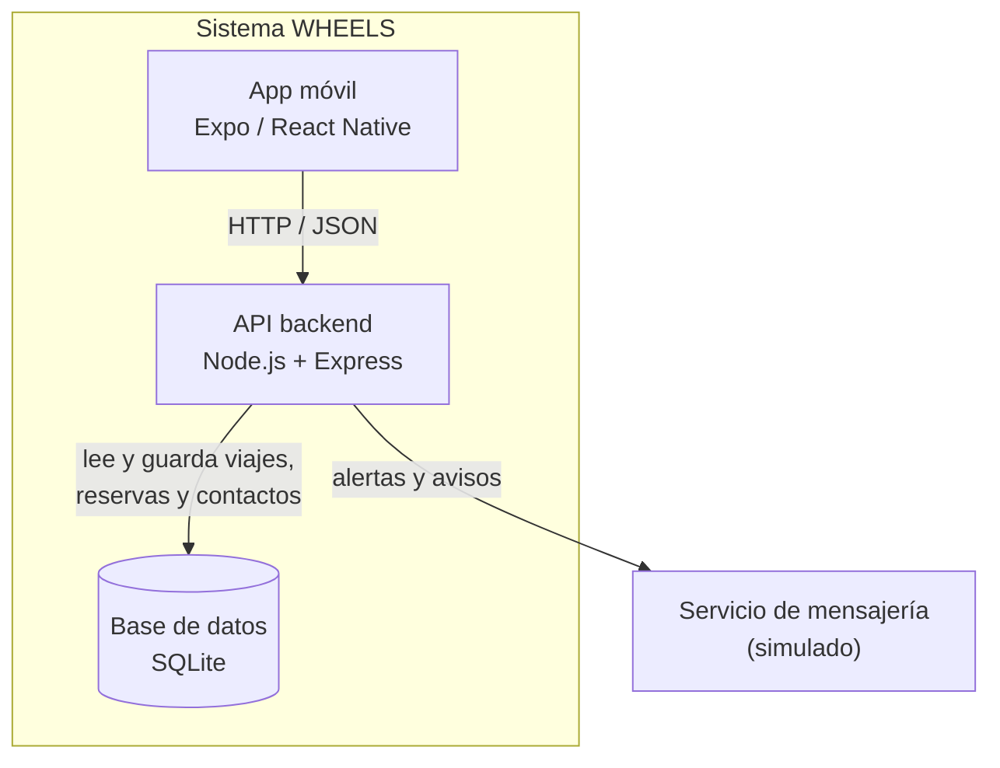
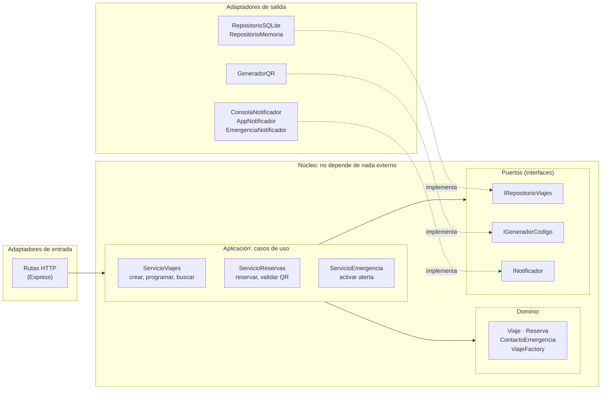

# Documento de Arquitectura – WHEELS (Corte 2)

> **Estado:** avance. Este documento cubre la **fase 1 (análisis de los retos)** y la **fase 2 (selección del estilo arquitectónico)**. Las secciones de pruebas y resultados se completan en la entrega final.

---

## 1. Descripción del sistema y resumen del Corte 1

WHEELS es una aplicación para organizar los viajes compartidos entre estudiantes de la universidad. Los conductores publican sus viajes (origen, destino, hora y cupos) y los pasajeros los consultan y reservan un cupo desde la app móvil.

En el Corte 1 construimos:

- Un **backend en Node.js + Express** con cuatro endpoints: crear viaje, listar viajes, reservar cupo y cancelar viaje.
- Una **app móvil en Expo / React Native** que consume esa API.
- El diseño de clases con principios **SOLID** y dos patrones:
  - **Factory Method** (`ViajeFactory`): crea los viajes y valida los datos.
  - **Observer** (`GestorViajes` + `INotificador`): avisa a los interesados cuando un viaje cambia (reserva, cupo lleno, cancelación).

Límites que dejamos reconocidos en el Corte 1: los datos se guardan **en memoria** (se pierden al reiniciar el servidor), **no hay autenticación** (cualquiera puede reservar) y no hay pruebas automatizadas.

---

## 2. Retos asignados

El profesor nos asignó tres retos para este corte. Cada uno exige agregar funcionalidad nueva, por eso lo dejamos indicado en la tabla de trazabilidad (el enunciado lo permite solo cuando un reto lo pide).

### Reto 1 – Autenticación con código QR

**Qué exige en nuestro sistema:** hoy cualquier persona puede reservar un cupo y el conductor no tiene forma de saber si quien se sube al carro es realmente quien reservó. Con este reto, al reservar, el pasajero recibe un **código QR único** ligado a su reserva. Al abordar, el conductor lo escanea y el backend confirma si el código es válido, si pertenece a ese viaje y si no se ha usado antes. El código debe **vencer** (por ejemplo, al terminar el viaje) para que no se pueda reutilizar.

**Atributos de calidad:**
- **Seguridad** (principal): solo quien reservó puede abordar; el código no se puede falsificar ni reutilizar.
- **Mantenibilidad**: si mañana cambiamos la librería de QR o la forma de firmar el código, no debería cambiar la lógica de reservas.

### Reto 2 – Contacto de emergencia

**Qué exige en nuestro sistema:** cada usuario registra un contacto de confianza. Durante un viaje, el pasajero (o el conductor) puede activar una **alerta** y el sistema le envía a ese contacto los datos del viaje: ruta, hora, placa o nombre del conductor. Esta alerta **no puede fallar** porque un canal de notificación esté caído: si falla uno, debe intentarse con otro.

**Atributos de calidad:**
- **Disponibilidad / confiabilidad** (principal): la alerta tiene que llegar aunque uno de los canales falle.
- **Mantenibilidad / extensibilidad**: poder agregar canales nuevos (SMS, WhatsApp) sin tocar la lógica de la alerta. Aquí aprovechamos el Observer que ya teníamos.

### Reto 3 – Planeación de viajes

**Qué exige en nuestro sistema:** hoy un viaje solo tiene una "hora" y vive en memoria. Con este reto, el conductor puede **programar viajes con anticipación** (fecha y hora futuras, por ejemplo los viajes de toda la semana) y el pasajero puede **buscar** viajes por fecha, origen y destino. Como un viaje planeado para la próxima semana no puede perderse si el servidor se reinicia, los datos tienen que **guardarse en una base de datos**. Además, la búsqueda debe seguir respondiendo rápido aunque haya muchos viajes publicados (por ejemplo, en semana de parciales).

**Atributos de calidad:**
- **Rendimiento** (principal): la búsqueda de viajes planeados debe responder rápido con muchos usuarios a la vez.
- **Mantenibilidad**: poder cambiar el almacenamiento (memoria → SQLite → otra BD) sin reescribir la lógica de negocio.

### Resumen

| Reto | Atributo principal | Atributo secundario |
|---|---|---|
| Autenticación QR | Seguridad | Mantenibilidad |
| Contacto de emergencia | Disponibilidad / confiabilidad | Extensibilidad |
| Planeación de viajes | Rendimiento | Mantenibilidad |

La tabla de trazabilidad completa (reto → decisión → dónde está → prueba → resultado) está en el [README](../README.md#7-corte-2--avance). Las columnas de prueba y resultado se llenan cuando implementemos.

---

## 3. Comparación de estilos y decisión

Evaluamos tres estilos. Los criterios salen directamente de los retos: cada reto pide un atributo de calidad, y además tuvimos en cuenta qué tan fácil es probar el sistema y si el estilo es proporcional al tamaño real del proyecto (un backend pequeño hecho por tres personas).

**Escala:** 1 = lo atiende mal, 2 = regular, 3 = lo atiende bien.

| Criterio (de dónde sale) | Capas | Hexagonal (puertos y adaptadores) | Microservicios |
|---|:---:|:---:|:---:|
| Seguridad – aislar la validación del QR (Reto 1) | 2 | 3 | 3 |
| Disponibilidad – cambiar de canal si uno falla (Reto 2) | 2 | 3 | 3 |
| Rendimiento – búsqueda de viajes (Reto 3) | 3 | 3 | 2 |
| Mantenibilidad – cambiar BD, librería QR o canal sin tocar el negocio (Retos 1, 2, 3) | 2 | 3 | 3 |
| Facilidad para probar el negocio sin BD ni red | 2 | 3 | 2 |
| Proporcional al tamaño del proyecto | 3 | 3 | 1 |
| **Total** | **14** | **18** | **14** |

**Por qué cada puntaje:**

- **Capas** es simple y rápido (las llamadas van directo de una capa a la siguiente), pero la capa de negocio queda dependiendo de la capa de datos. Cambiar la BD o la librería de QR termina tocando el negocio, y para probarlo hay que simular la capa de abajo.
- **Hexagonal** pone el negocio en el centro y lo comunica con el exterior a través de **puertos** (interfaces). La BD, el QR y los canales de notificación son **adaptadores** que se pueden cambiar. Nosotros ya teníamos un puerto sin llamarlo así: `INotificador`.
- **Microservicios** separaría viajes, autenticación y emergencias en servicios distintos. Ayuda a la disponibilidad, pero agrega red entre servicios (más latencia), despliegues separados y más cosas que pueden fallar. Para tres retos y un equipo de tres personas es desproporcionado.

**Decisión:** **arquitectura hexagonal**. El detalle, con lo que ganamos y lo que sacrificamos, está en el [ADR-001](adr/ADR-001-arquitectura-hexagonal.md).

---

## 4. Arquitectura inicial (Corte 1) y arquitectura evolucionada (Corte 2)

### 4.1 Arquitectura inicial (Corte 1)

Todo el backend estaba organizado por tipo de clase y `server.js` hacía de todo: rutas HTTP, armado de dependencias y arranque del servidor.



### 4.2 Arquitectura evolucionada (Corte 2) – propuesta

> Estos diagramas muestran la arquitectura **a la que vamos a llegar**. La reorganización del código se hace en la siguiente fase; cuando esté lista, los diagramas se revisarán para que coincidan exactamente con el repositorio.

**Diagrama de contexto (C4 – nivel 1):** quién usa el sistema y con qué se comunica.



**Diagrama de contenedores (C4 – nivel 2):** las piezas que se ejecutan.



**Diagrama de componentes (C4 – nivel 3) de la API, en estilo hexagonal:**



**Regla principal del estilo:** las flechas siempre apuntan **hacia el núcleo**. El dominio y los casos de uso solo conocen los puertos (interfaces); nunca importan Express, SQLite ni la librería de QR. Quien conecta cada puerto con su adaptador es un archivo de arranque (hoy `server.js`).

### 4.3 Estructura de carpetas propuesta para el backend

```
backend/src/
├── dominio/            ← Viaje, Reserva, ContactoEmergencia, ViajeFactory
├── aplicacion/         ← ServicioViajes, ServicioReservas, ServicioEmergencia
├── puertos/            ← IRepositorioViajes, IGeneradorCodigo, INotificador
├── adaptadores/
│   ├── entrada/http/   ← rutas de Express
│   └── salida/
│       ├── persistencia/   ← RepositorioSQLite, RepositorioMemoria
│       ├── qr/             ← GeneradorQR
│       └── notificaciones/ ← ConsolaNotificador, AppNotificador, EmergenciaNotificador
└── server.js           ← arma las dependencias y arranca el servidor
```

**Cómo se reubica lo que ya existe:**

| Archivo actual | Nueva ubicación |
|---|---|
| `modelo/Viaje.js` | `dominio/Viaje.js` |
| `factoria/ViajeFactory.js` | `dominio/ViajeFactory.js` |
| `modelo/GestorViajes.js` | se convierte en `aplicacion/ServicioViajes.js` (ya no guarda la lista él mismo, usa `IRepositorioViajes`) |
| `notificaciones/INotificador.js` | `puertos/INotificador.js` |
| `notificaciones/ConsolaNotificador.js` y `AppNotificador.js` | `adaptadores/salida/notificaciones/` |
| rutas dentro de `server.js` | `adaptadores/entrada/http/rutas.js` |

---

## 5. Estrategia de pruebas

*Pendiente – se completa en la siguiente entrega.* Idea general: pruebas unitarias con Jest sobre el dominio y los casos de uso (con dobles de prueba para los puertos), pruebas de integración con Supertest y SQLite en memoria, y pruebas de carga con k6 en la carpeta `perf/`.

## 6. Resultados de las pruebas

*Pendiente.*

## 7. Límites conocidos y trabajo pendiente

- **El código todavía no está reorganizado.** Los diagramas de la sección 4.2 son la meta; hoy el código sigue la estructura del Corte 1.
- **Autenticación de usuarios:** el QR valida la *reserva*, no un inicio de sesión completo. No vamos a implementar registro con contraseña en este corte.
- **Mensajería real:** los canales de notificación y de emergencia se simulan (consola). Conectar un proveedor real de SMS o correo queda fuera del alcance.
- **Base de datos:** SQLite sirve para un solo servidor. Si el sistema creciera a varias instancias habría que pasar a una BD de servidor (por ejemplo PostgreSQL); gracias al puerto `IRepositorioViajes` sería solo un adaptador nuevo.
