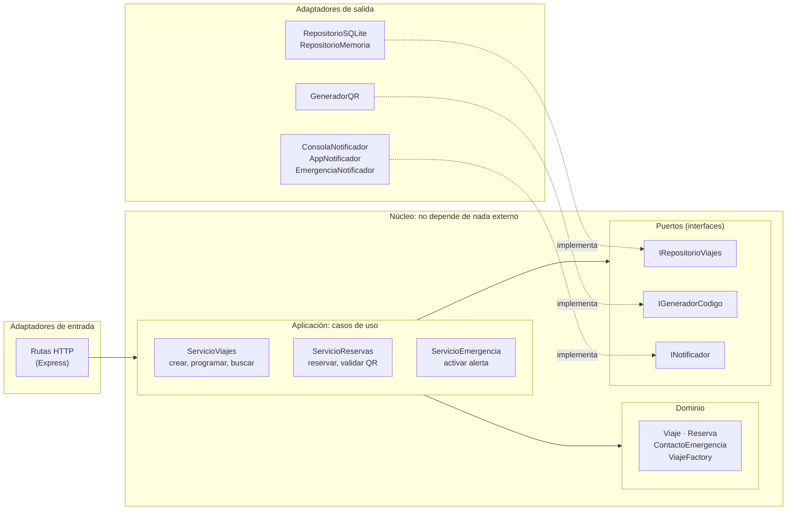

# Diagrama de componentes de la API (C4 – nivel 3, estilo hexagonal)

Explicación completa en [arquitectura.md](../arquitectura.md#4-arquitectura-inicial-corte-1-y-arquitectura-evolucionada-corte-2).
