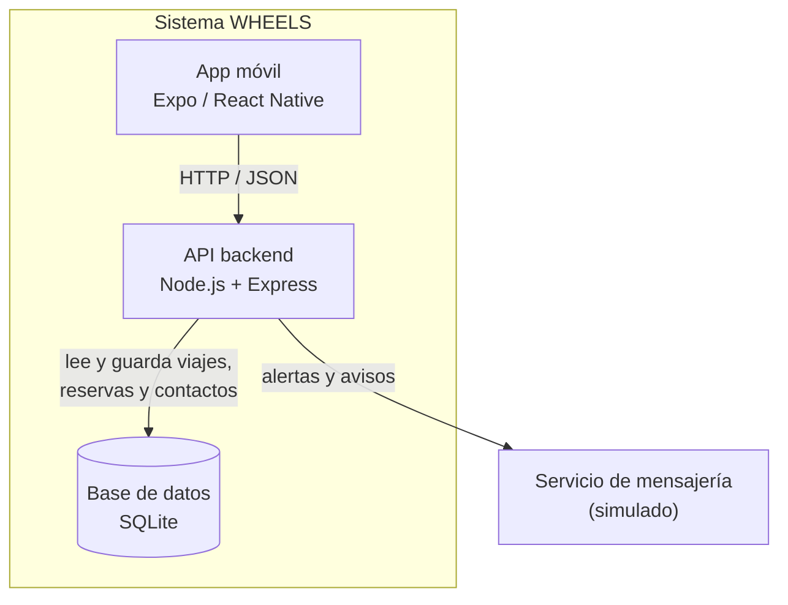

# Diagrama de contenedores (C4 – nivel 2)

```mermaid
flowchart TB
    subgraph WHEELS["Sistema WHEELS"]
        App["App móvil<br/>Expo / React Native"]
        API["API backend<br/>Node.js + Express"]
        BD[("Base de datos<br/>SQLite")]
    end
    Mensajeria["Servicio de mensajería<br/>(simulado)"]

    App -->|HTTP / JSON| API
    API -->|lee y guarda viajes,<br/>reservas y contactos| BD
    API -->|alertas y avisos| Mensajeria
```

Explicación completa en [arquitectura.md](../arquitectura.md#4-arquitectura-inicial-corte-1-y-arquitectura-evolucionada-corte-2).
