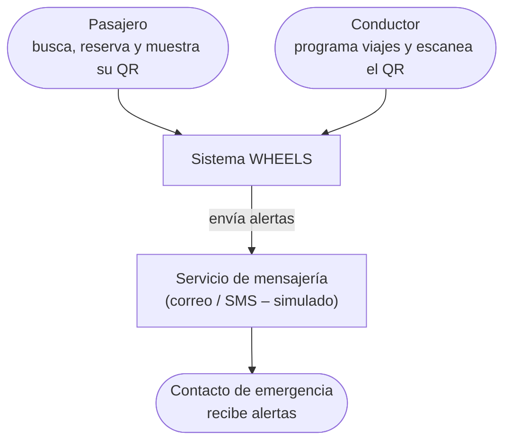

# Diagrama de contexto (C4 – nivel 1)

```mermaid
flowchart TB
    Pasajero(["Pasajero<br/>busca, reserva y muestra su QR"])
    Conductor(["Conductor<br/>programa viajes y escanea el QR"])
    Contacto(["Contacto de emergencia<br/>recibe alertas"])
    Wheels["Sistema WHEELS"]
    Mensajeria["Servicio de mensajería<br/>(correo / SMS – simulado)"]

    Pasajero --> Wheels
    Conductor --> Wheels
    Wheels -->|envía alertas| Mensajeria
    Mensajeria --> Contacto
```

Explicación completa en [arquitectura.md](../arquitectura.md#4-arquitectura-inicial-corte-1-y-arquitectura-evolucionada-corte-2).
