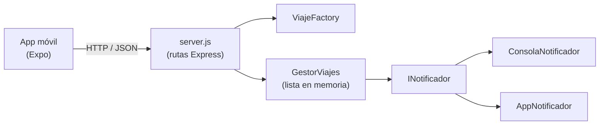
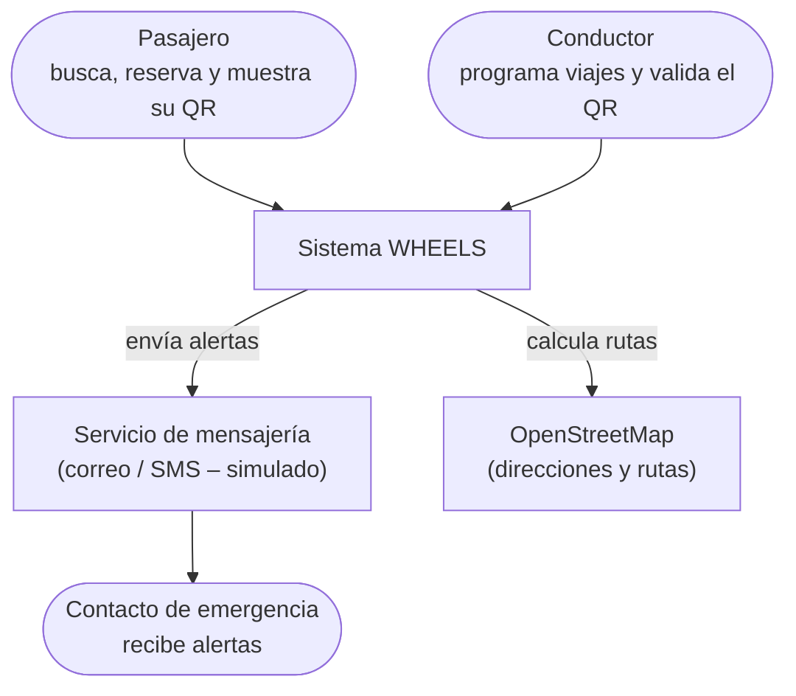
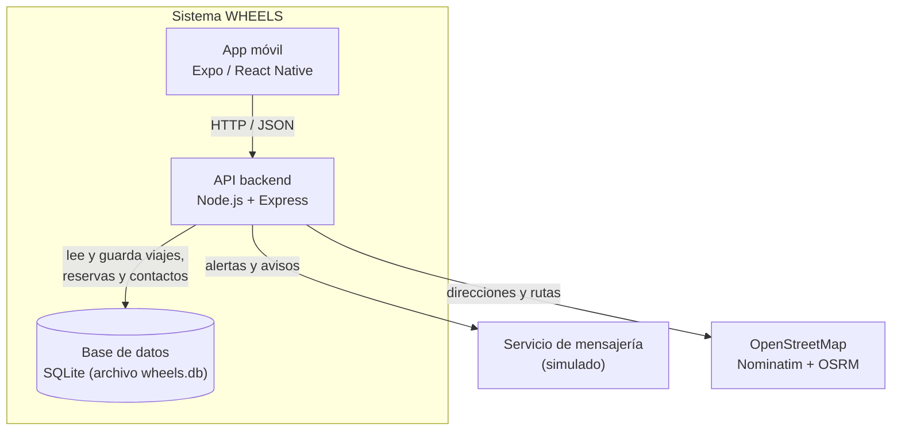
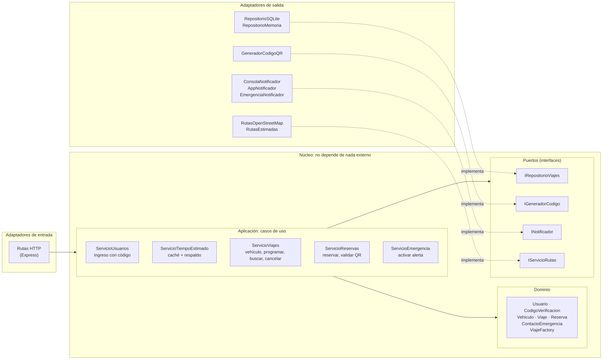

# Documento de Arquitectura – WHEELS (Corte 2)

---

## 1. Descripción del sistema y resumen del Corte 1

WHEELS es una aplicación para organizar los viajes compartidos entre estudiantes de la universidad. Los conductores publican sus viajes (origen, destino, hora y cupos) y los pasajeros los consultan y reservan un cupo desde la app móvil.

En el Corte 1 construimos:

- Un **backend en Node.js + Express** con cuatro endpoints: crear viaje, listar viajes, reservar cupo y cancelar viaje.
- Una **app móvil en Expo / React Native** que consume esa API.
- El diseño de clases con principios **SOLID** y dos patrones:
  - **Factory Method** (`ViajeFactory`): crea los viajes y valida los datos.
  - **Observer** (`GestorViajes` + `INotificador`): avisa a los interesados cuando un viaje cambia (reserva, cupo lleno, cancelación).

Límites que dejamos reconocidos en el Corte 1: los datos se guardan **en memoria** (se pierden al reiniciar el servidor), **no hay autenticación** (cualquiera puede reservar) y no hay pruebas automatizadas.

---

## 2. Retos asignados

El profesor nos asignó tres retos para este corte. Cada uno exige agregar funcionalidad nueva, por eso lo dejamos indicado en la tabla de trazabilidad (el enunciado lo permite solo cuando un reto lo pide).

### Reto 1 – Autenticación con código QR

**Qué exige en nuestro sistema:** hoy cualquier persona puede reservar un cupo y el conductor no tiene forma de saber si quien se sube al carro es realmente quien reservó. Resolvemos la autenticación en dos niveles:

1. **Solo estudiantes de La Sabana:** para ingresar a la app se usa el correo institucional (`@unisabana.edu.co`). El sistema envía un **código de 6 dígitos** al correo, que vence en 10 minutos y solo sirve una vez. Sin correo verificado no se puede reservar ni programar viajes.
2. **Solo aborda el pasajero que el conductor aceptó:** el pasajero **solicita un cupo** escribiendo dónde lo recogen, y el conductor decide si lo acepta o lo rechaza. Solo al aceptar se genera un **código QR único** ligado a esa reserva. Al abordar, el conductor lo escanea y el backend confirma si el código es válido, si pertenece a ese viaje y si no se ha usado antes. El código **vence** al terminar el día del viaje.
3. **El pasajero también verifica el carro:** el conductor registra la placa y la descripción de su vehículo (marca, modelo y color) antes de programar viajes. El pasajero ve el nombre del conductor al buscar, y la placa y la descripción solo cuando lo aceptan, junto a su QR. Así sabe a qué carro subirse sin exponer la placa a cualquiera.

**Atributos de calidad:**
- **Seguridad** (principal): solo estudiantes verificados usan la app y solo quien reservó puede abordar; los códigos no se adivinan ni se reutilizan. El pasajero confirma la placa antes de subirse.
- **Mantenibilidad**: si mañana cambiamos la librería de QR o la forma de firmar el código, no debería cambiar la lógica de reservas.

### Reto 2 – Contacto de emergencia

**Qué exige en nuestro sistema:** cada usuario registra un contacto de confianza. Durante un viaje, el pasajero (o el conductor) puede activar una **alerta** y el sistema le envía a ese contacto los datos del viaje: ruta, hora, placa o nombre del conductor. Esta alerta **no puede fallar** porque un canal de notificación esté caído: si falla uno, debe intentarse con otro.

**Atributos de calidad:**
- **Disponibilidad / confiabilidad** (principal): la alerta tiene que llegar aunque uno de los canales falle.
- **Mantenibilidad / extensibilidad**: poder agregar canales nuevos (SMS, WhatsApp) sin tocar la lógica de la alerta. Aquí aprovechamos el Observer que ya teníamos.

### Reto 3 – Planeación de viajes

**Qué exige en nuestro sistema:** para planear su viaje, el estudiante necesita saber **cuánto se va a demorar desde donde está hasta el destino** del viaje. La app toma la ubicación actual del celular (GPS) y el backend calcula la distancia y el tiempo por las calles hasta el destino que escribió el conductor. Para eso depende de un **servicio externo de mapas** (OpenStreetMap), que puede ser lento, tener límite de uso o no responder. Además, los viajes se programan con fecha y hora, se buscan por fecha, origen y destino, y se guardan en una base de datos para no perderlos al reiniciar.

**Atributos de calidad:**
- **Rendimiento** (principal): la respuesta debe ser rápida aunque el servicio de mapas tarde. Se resuelve con un **caché**: las rutas ya calculadas se guardan 5 minutos y las direcciones ya ubicadas no se vuelven a buscar.
- **Disponibilidad**: si el servicio de mapas falla, el usuario igual recibe un tiempo aproximado (**respaldo** con un cálculo propio).
- **Mantenibilidad**: cambiar OpenStreetMap por Google Maps u otro proveedor no debe tocar la lógica del negocio. El servicio de mapas está detrás del puerto `IServicioRutas`.

### Resumen

| Reto | Atributo principal | Atributo secundario |
|---|---|---|
| Autenticación QR | Seguridad | Mantenibilidad |
| Contacto de emergencia | Disponibilidad / confiabilidad | Extensibilidad |
| Planeación de viajes (tiempo estimado) | Rendimiento | Disponibilidad y mantenibilidad |

La tabla de trazabilidad completa (reto → decisión → dónde está → prueba → resultado) está en el [README](../README.md#4-tabla-de-trazabilidad).

---

## 3. Comparación de estilos y decisión

Evaluamos tres estilos. Los criterios salen directamente de los retos: cada reto pide un atributo de calidad, y además tuvimos en cuenta qué tan fácil es probar el sistema y si el estilo es proporcional al tamaño real del proyecto (un backend pequeño hecho por tres personas).

**Escala:** 1 = lo atiende mal, 2 = regular, 3 = lo atiende bien.

| Criterio (de dónde sale) | Capas | Hexagonal (puertos y adaptadores) | Microservicios |
|---|:---:|:---:|:---:|
| Seguridad – aislar la validación del QR (Reto 1) | 2 | 3 | 3 |
| Disponibilidad – cambiar de canal si uno falla (Reto 2) | 2 | 3 | 3 |
| Rendimiento – tiempo estimado con un servicio externo lento (Reto 3) | 3 | 3 | 2 |
| Mantenibilidad – cambiar BD, librería QR o canal sin tocar el negocio (Retos 1, 2, 3) | 2 | 3 | 3 |
| Facilidad para probar el negocio sin BD ni red | 2 | 3 | 2 |
| Proporcional al tamaño del proyecto | 3 | 3 | 1 |
| **Total** | **14** | **18** | **14** |

**Por qué cada puntaje:**

- **Capas** es simple y rápido (las llamadas van directo de una capa a la siguiente), pero la capa de negocio queda dependiendo de la capa de datos. Cambiar la BD o la librería de QR termina tocando el negocio, y para probarlo hay que simular la capa de abajo.
- **Hexagonal** pone el negocio en el centro y lo comunica con el exterior a través de **puertos** (interfaces). La BD, el QR y los canales de notificación son **adaptadores** que se pueden cambiar. Nosotros ya teníamos un puerto sin llamarlo así: `INotificador`.
- **Microservicios** separaría viajes, autenticación y emergencias en servicios distintos. Ayuda a la disponibilidad, pero agrega red entre servicios (más latencia), despliegues separados y más cosas que pueden fallar. Para tres retos y un equipo de tres personas es desproporcionado.

**Decisión:** **arquitectura hexagonal**. El detalle, con lo que ganamos y lo que sacrificamos, está en el [ADR-001](adr/ADR-001-arquitectura-hexagonal.md).

---

## 4. Arquitectura inicial (Corte 1) y arquitectura evolucionada (Corte 2)

### 4.1 Arquitectura inicial (Corte 1)

Todo el backend estaba organizado por tipo de clase y `server.js` hacía de todo: rutas HTTP, armado de dependencias y arranque del servidor.



### 4.2 Arquitectura evolucionada (Corte 2)

Los diagramas corresponden al código que está en `backend/src/`.

**Diagrama de contexto (C4 – nivel 1):** quién usa el sistema y con qué se comunica.



**Diagrama de contenedores (C4 – nivel 2):** las piezas que se ejecutan.



**Diagrama de componentes (C4 – nivel 3) de la API, en estilo hexagonal:**



**Regla principal del estilo:** las flechas siempre apuntan **hacia el núcleo**. El dominio y los casos de uso solo conocen los puertos (interfaces); nunca importan Express, SQLite ni la librería de QR. Quien conecta cada puerto con su adaptador es `configuracion.js`, el único archivo que conoce a la vez el núcleo y los adaptadores.

### 4.3 Estructura de carpetas del backend

```
backend/src/
├── dominio/            ← Usuario, CodigoVerificacion, Vehiculo, Viaje, Reserva, ContactoEmergencia, ViajeFactory
├── aplicacion/         ← ServicioUsuarios, ServicioViajes, ServicioReservas, ServicioEmergencia, ServicioTiempoEstimado
├── puertos/            ← IRepositorioViajes, IGeneradorCodigo, INotificador, IServicioRutas
├── adaptadores/
│   ├── entrada/http/   ← crearApp.js (rutas de Express)
│   └── salida/
│       ├── persistencia/   ← RepositorioSQLite, RepositorioMemoria
│       ├── qr/             ← GeneradorCodigoQR
│       ├── rutas/          ← RutasOpenStreetMap, RutasEstimadas (respaldo), RutasSimuladasLentas (pruebas de carga)
│       └── notificaciones/ ← ConsolaNotificador, AppNotificador, EmergenciaNotificador
├── configuracion.js    ← conecta cada puerto con su adaptador
├── datosDePrueba.js    ← 500 viajes de ejemplo para las pruebas de carga
└── server.js           ← arranca el servidor
```

**Qué pasó con las clases del Corte 1:**

| Corte 1 | Corte 2 |
|---|---|
| `modelo/Viaje.js` | `dominio/Viaje.js` (ahora tiene fecha y no deja reservar un viaje cancelado) |
| `factoria/ViajeFactory.js` | `dominio/ViajeFactory.js` (valida fecha futura, formato y cupos entre 1 y 6) |
| `modelo/GestorViajes.js` | se dividió en `aplicacion/ServicioViajes.js` y `aplicacion/ServicioReservas.js`; ya no guardan la lista ellos mismos, usan `IRepositorioViajes` |
| `notificaciones/INotificador.js` | `puertos/INotificador.js` |
| `notificaciones/ConsolaNotificador.js` y `AppNotificador.js` | `adaptadores/salida/notificaciones/` |
| rutas dentro de `server.js` | `adaptadores/entrada/http/crearApp.js` |

### 4.4 App móvil

La app (Expo / React Native) es el cliente de la API. Aplica la misma idea de separar responsabilidades:

- `mobile/servicios/api.ts` es el único archivo que conoce las URLs y hace las peticiones HTTP (funciona como un adaptador). Las pantallas solo llaman sus funciones.
- `mobile/servicios/sesion.tsx` guarda quién ingresó.
- `mobile/components/wheels/` tiene las piezas visuales reutilizables (botones, campos, tarjetas).

| Pantalla | Rol | Reto |
|---|---|---|
| Ingreso y verificación del correo | Todos | 1 |
| Viajes: buscar, ver el nombre del conductor y por dónde pasa, "¿Cuánto me demoro?" con mapa, y solicitar cupo con punto de recogida | Pasajero | 3 y 1 |
| Mis reservas: estado de la solicitud, código QR y "Tu wheels" con la placa (si fue aceptada) y tiempo estimado | Pasajero | 1 y 3 |
| Mis viajes: Mi vehículo (placa y descripción), programar (con "por dónde pasa") y cancelar | Conductor | 1 y 3 |
| Solicitudes: aceptar o rechazar pasajeros según el punto de recogida | Conductor | 1 |
| Validar QR: cámara o código escrito | Conductor | 1 |
| Emergencia: contacto y botón de pánico (envía la ubicación) | Todos | 2 |

---

## 5. Estrategia de pruebas

Cada nivel de prueba revisa una parte distinta del hexágono. El detalle está en [pruebas.md](pruebas.md).

| Nivel | Qué prueba | Con qué |
|---|---|---|
| Unitarias | Reglas del dominio y casos de uso, sin BD, red ni Express | `node:test`, dobles de prueba para los puertos |
| Integración | Cada adaptador real contra su puerto (SQLite, QR) y la API completa por HTTP | `node:test`, SQLite real (sql.js), `fetch` |
| Carga | Que la búsqueda y las alertas cumplan el SLO con muchos usuarios | k6 (`perf/scripts/`) |

## 6. Resultados de las pruebas

Ver [pruebas.md](pruebas.md#resultados).

## 7. Límites conocidos y trabajo pendiente

- **Autenticación de usuarios:** el ingreso es con correo institucional y código, sin contraseña. La app guarda la sesión en memoria (al cerrarla hay que volver a ingresar) y el backend no usa tokens de sesión: confía en el correo que envía la app. Agregar tokens (por ejemplo JWT) sería el siguiente paso.
- **Correo simulado:** el código de verificación se "envía" por consola. Conectar un servicio real de correo sería un adaptador nuevo del puerto `INotificador`.
- **Mensajería real:** los canales de notificación y de emergencia se simulan en consola. Conectar un proveedor real de SMS o correo sería un adaptador nuevo.
- **Base de datos:** SQLite (con sql.js) guarda todo el archivo en cada escritura. Sirve para un solo servidor y poco volumen de escrituras. Si el sistema creciera habría que pasar a una BD de servidor (por ejemplo PostgreSQL); gracias al puerto `IRepositorioViajes` sería solo un adaptador nuevo.
- **Tiempo estimado sin tráfico:** OpenStreetMap calcula la ruta por las calles pero no conoce el tráfico en vivo. El respaldo (`RutasEstimadas`) es aún más aproximado: línea recta × 1,3 a 30 km/h, y solo reconoce lugares conocidos de la zona. Un proveedor con tráfico (Google) sería otro adaptador del mismo puerto.
- **Servidores públicos de OpenStreetMap:** tienen límite de uso (Nominatim pide máximo una consulta por segundo). El caché reduce las consultas, pero para producción habría que usar un servidor propio o uno pago.
- **Sin tolerancia a caídas del servidor:** si el backend se cae, se cae todo, incluidas las alertas. Lo aceptamos en el ADR porque ningún reto lo exige.
- **Para el Corte 3:** automatizar estas pruebas en un pipeline de CI/CD.
- **Propuestas para el Corte 3:**
  - Ubicación del conductor en tiempo real para que el pasajero vea qué tan cerca está.
  - Autocompletar direcciones mientras se escriben.
  - Que el botón de pánico envíe un SMS real al celular del contacto. La forma más sencilla es abrir la app de mensajes del celular con el número y la ubicación ya escritos; la automática es un adaptador nuevo de `INotificador` con un proveedor como Twilio.
